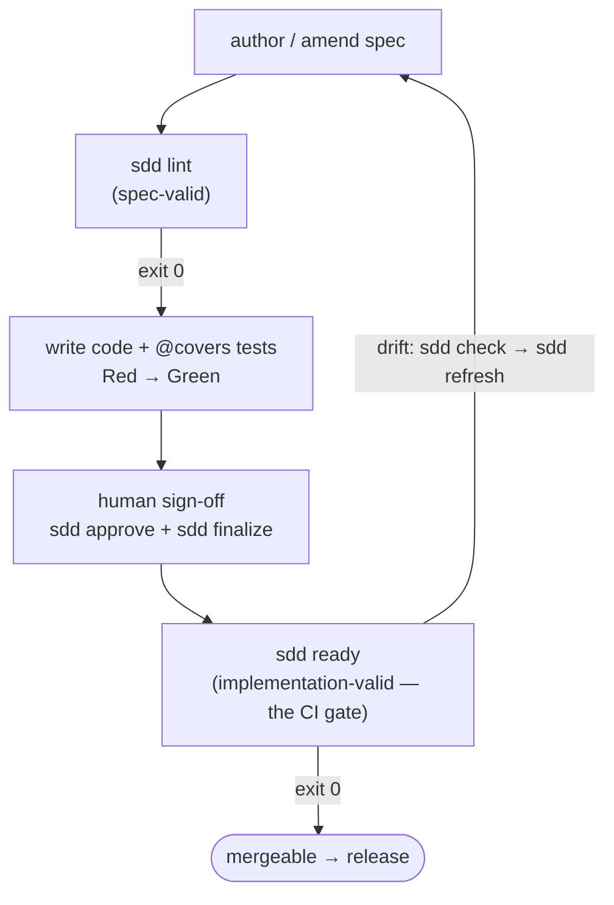

# `agent-sdd`

[](https://github.com/cyberash-dev/agent-sdd/actions/workflows/ci.yml)
[](LICENSE)
[](package.json)

📖 Read this in other languages: [Русский](README.ru.md)

**`agent-sdd` is the command-line companion for Spec-Driven Development (SDD)** —
a way of building software where a typed, versioned specification is the single
source of truth, and code is only ever generated *after* the spec that describes
it. The CLI does two jobs:

1. **It distributes the SDD methodology to your AI coding agent** (Claude Code,
   Codex, …) so the agent knows the discipline — `sdd install`.
2. **It mechanically enforces the discipline** — it fingerprints your code, lints
   the spec, gates approvals, and blocks a merge whenever code and spec have
   drifted apart.

> **Status:** v1.4.0, itself governed by `spec/spec.md`. This README covers the
> core concepts and gets you running. The deep material lives in [`docs/`](#documentation).

---

## Spec-Driven Development in one minute

SDD flips the usual order of work: **the spec changes first, the code second.**
Any behaviour found in code but absent from the spec is either lifted into the
spec or explicitly marked as unmodeled — never silently kept.

Three ideas carry the whole method:

- **Typed normative IDs.** Every rule the system must obey is one atomic,
  numbered record with a type: `Behavior`, `Contract`, `Invariant`, `Policy`,
  `Surface`, `Delta`, `Migration`, and a handful more. Each has required, typed
  fields and its own lifecycle (`draft → proposed → approved → deprecated →
  removed`).
- **Three gates.** `baseline-valid` (the spec still describes the real repo),
  `spec-valid` (the spec is well-formed), `implementation-valid` (every approved
  rule is covered by a green test). A change moves forward only when its gate is
  green.
- **The freshness token.** A deterministic hash over a configured *Discovery
  scope* of your repo, recorded in the spec. When the code drifts, the token
  stops matching and the gate stops the merge — the mechanical signal that
  "spec and code disagree."

Approval is **human-only by design**: `sdd approve` refuses agent identities, so
an AI can propose a spec change but cannot sign it off.

New to the method? Start with **[docs/sdd-methodology.md](docs/sdd-methodology.md)**.

### The SDD loop



The full annotated flowchart, every branch, and worked scenarios are in
**[docs/sdd-methodology.md → The SDD loop](docs/sdd-methodology.md#the-sdd-loop)**.

---

## Quick start

### 1. Requirements

- **Node.js ≥ 22**
- The default backend is **git** (`git ≥ 2.30` on `PATH`, run inside a repo). The
  VCS is pluggable — see [Writing a VCS adapter](docs/writing-vcs-adapters.md).

### 2. Install the CLI

```sh
npm install --save-dev agent-sdd
```

`sdd` is then available via `npx sdd …` or a package script. Other install
options (local path, tarball) are in [docs/commands.md](docs/commands.md).

### 3. Teach your agent the methodology

This is what makes an AI agent *follow* SDD instead of just having the CLI
available. One command installs the rules, an on-demand skill, and (for Claude)
the enforcement hooks into your agent config:

```sh
npx sdd install claude      # ~/.claude  (rules + skill + 2 hooks)
npx sdd install codex       # ~/.codex   (rules + AGENTS.md reference)
npx sdd install all         # both
npx sdd install all --dry-run   # preview, write nothing
```

What lands where, the hooks, and `--scope project` are documented in
**[docs/installing-rules.md](docs/installing-rules.md)**.

### 4. Configure the repo

Drop a single file at `<repo>/.sdd/config.json`:

```json
{
  "$schema": "https://github.com/cyberash-dev/agent-sdd/blob/main/schema/sdd.config.schema.json",
  "spec_file": "spec/spec.md",
  "baseline_id": "my-partition:BL-001",
  "discovery_scope": ["src", "tests", "package.json"],
  "mechanism": "git_tree_hash_v1"
}
```

Add a `BrownfieldBaseline` block to your spec with placeholder
`freshness_token` / `baseline_commit_sha`. Every field is explained in
**[docs/configuration.md](docs/configuration.md)**.

### 5. Bootstrap the baseline

```sh
npx sdd token --format=json
npx sdd approve --id my-partition:BL-001 \
  --approver alice --owner-role tech-lead \
  --change-request https://example.com/pr/1
npx sdd finalize
npx sdd check
```

### 6. Run the loop

```sh
npx sdd lint
npx sdd ready
```

Wire `sdd ready` into your protected-branch policy and the SDD three-gate
contract becomes enforceable in practice.

---

## Command cheat sheet

| Command       | Purpose                                                                       |
|---------------|-------------------------------------------------------------------------------|
| `sdd token`   | Compute the current scope fingerprint at `HEAD`.                              |
| `sdd check`   | Compare that fingerprint against the value recorded in the spec.             |
| `sdd refresh` | Emit `Delta` / `Open-Q` stubs for every path that drifted since the baseline.|
| `sdd lint`    | Run SDD spec-lint rules over your spec files (`spec-valid`).                  |
| `sdd approve` | Queue a human sign-off flipping a `proposed` ID toward `approved`.           |
| `sdd finalize`| Atomically apply the queued approvals after graph validation.                |
| `sdd plan`    | Inspect the pending approval attestations in the active plan.                |
| `sdd ready`   | The single `implementation-valid` CI gate (superset of `lint` + `check`).    |
| `sdd record`  | Navigate/edit the spec one record at a time (read-only `list`/`get`).        |
| `sdd report`  | Emit a PR-summary skeleton against a base ref.                               |
| `sdd doctor`  | Check CLI ↔ enforcement-registry version compatibility.                      |
| `sdd install` | Distribute the SDD methodology rules (+ Claude hooks) into your agent config.|

Every flag, exit code, and output shape is in **[docs/commands.md](docs/commands.md)**.
All commands are **read-only on the spec except `sdd approve` / `sdd finalize`**,
which atomically write `lifecycle.status` + `approval_record`, and `sdd record
set`/`add`, which edit a single draft/proposed record.

---

## Documentation

| Document | What it covers |
|----------|----------------|
| [docs/sdd-methodology.md](docs/sdd-methodology.md) | The SDD approach, normative IDs, the three gates, the full SDD loop and worked workflows. |
| [docs/installing-rules.md](docs/installing-rules.md) | `sdd install` in depth — what is distributed, per-target layout, hooks, user vs project scope. |
| [docs/commands.md](docs/commands.md) | Complete command reference: flags, exit codes, JSON envelopes. |
| [docs/configuration.md](docs/configuration.md) | `.sdd/config.json`, the Brownfield-baseline block, partitions. |
| [docs/writing-vcs-adapters.md](docs/writing-vcs-adapters.md) | Building an external VCS adapter against the `Vcs` port. |
| [`spec/spec.md`](spec/spec.md) | The normative specification — the source of truth for this tool itself. |
| [CHANGELOG.md](CHANGELOG.md) · [AGENTS.md](AGENTS.md) | Release notes · rules for AI agents working in this repo. |

Russian: [README.ru.md](README.ru.md) and the `*.ru.md` mirror of each doc.

---

## Contributing

This is a personal tool published for reuse. PRs are welcome, but the SDD
discipline is enforced: every behaviour change needs a matching spec update in
the same PR, `sdd lint` must exit 0, and `sdd approve` is human-only (the CLI
refuses agent identities). See [AGENTS.md](AGENTS.md) for the rules an AI coding
agent must follow in this repo.

## License

[Apache License 2.0](LICENSE). When redistributing this software or derivative
works, keep the [`NOTICE`](NOTICE) file and its attribution, as required by
section 4 of the License.
