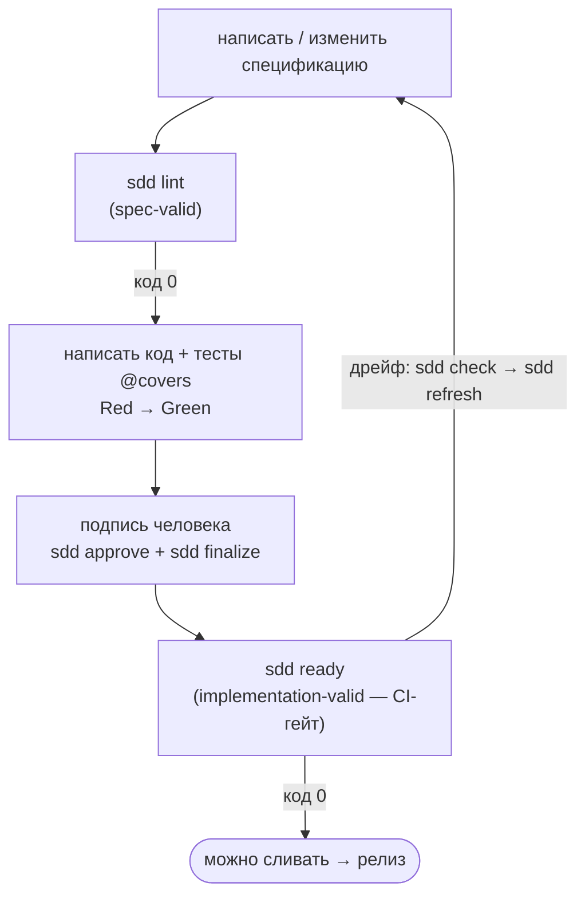

# `agent-sdd`

[](https://github.com/cyberash-dev/agent-sdd/actions/workflows/ci.yml)
[](LICENSE)
[](package.json)

📖 На других языках: [English](README.md)

**`agent-sdd` — это консольный компаньон для Spec-Driven Development (SDD)** —
подхода к разработке ПО, в котором типизированная версионируемая спецификация
является единственным источником истины, а код всегда порождается *только после*
описывающей его спецификации. CLI решает две задачи:

1. **Он распространяет методологию SDD на вашего ИИ-агента**
   (Claude Code, Codex, …), чтобы агент знал дисциплину — `sdd install`.
2. **Он механически обеспечивает соблюдение дисциплины** — снимает отпечаток
   вашего кода, линтит спецификацию, контролирует утверждения и блокирует мёрж
   всякий раз, когда код и спецификация разошлись.

> **Статус:** v1.4.0, сам управляется через `spec/spec.md`. Этот README
> охватывает ключевые концепции и помогает начать работу. Углублённый материал
> находится в [`docs/`](#документация).

---

## Spec-Driven Development за одну минуту

SDD переворачивает привычный порядок работы: **сначала меняется спецификация,
потом код.** Любое поведение, найденное в коде, но отсутствующее в спецификации,
либо переносится в спецификацию, либо явно помечается как устаревшее/удаленное —
никогда не сохраняется молча.

Весь метод держится на трёх идеях:

- **Типизированные нормативные ID.** Каждое правило, которому система обязана
  подчиняться, — это одна атомарная нумерованная запись с типом: `Behavior`,
  `Contract`, `Invariant`, `Policy`, `Surface`, `Delta`, `Migration` и ещё
  несколько. У каждой есть обязательные типизированные поля и собственный
  жизненный цикл (`draft → proposed → approved → deprecated → removed`).
- **Три гейта.** `baseline-valid` (спецификация по-прежнему описывает реальный
  репозиторий), `spec-valid` (спецификация корректно оформлена),
  `implementation-valid` (каждое утверждённое правило покрыто зелёным тестом).
  Изменение продвигается вперёд только тогда, когда его гейт зелёный.
- **Токен свежести (freshness token).** Детерминированный хеш по настроенной
  *области обнаружения (Discovery scope)* вашего репозитория, записанный в
  спецификацию. Когда код дрейфует, токен перестаёт совпадать и гейт
  останавливает мёрж — механический сигнал того, что «спецификация и код
  расходятся».

Утверждение **по замыслу доступно только человеку**: `sdd approve` отказывает
агентским идентичностям, поэтому ИИ может предложить изменение спецификации, но
не может его подписать.

Впервые знакомитесь с методом? Начните с
**[docs/sdd-methodology.ru.md](docs/sdd-methodology.ru.md)**.

### Цикл SDD



Полная аннотированная блок-схема, каждая ветвь и разобранные сценарии находятся в
**[docs/sdd-methodology.ru.md → Цикл SDD](docs/sdd-methodology.ru.md#цикл-sdd)**.

---

## Быстрый старт

### 1. Требования

- **Node.js ≥ 20**
- Бэкенд по умолчанию — **git** (`git ≥ 2.30` в `PATH`, запуск внутри
  репозитория). VCS подключаема — см. [Написание VCS-адаптера](docs/writing-vcs-adapters.ru.md).

### 2. Установите CLI

```sh
npm install --save-dev agent-sdd
```

После этого `sdd` доступен через `npx sdd …` или скрипт пакета. Другие варианты
установки (локальный путь, tarball) описаны в [docs/commands.ru.md](docs/commands.ru.md).

### 3. Обучите агента методологии

Именно это заставляет ИИ-агента *следовать* SDD, а не просто иметь доступ к CLI.
Одна команда устанавливает правила, скилл по запросу и (для Claude) хуки
принуждения в конфигурацию вашего агента:

```sh
npx sdd install claude      # ~/.claude  (правила + скилл + 2 хука)
npx sdd install codex       # ~/.codex   (правила + ссылка в AGENTS.md)
npx sdd install all         # оба
npx sdd install all --dry-run   # предпросмотр, ничего не пишет
```

Что и куда попадает, хуки и `--scope project` описаны в
**[docs/installing-rules.ru.md](docs/installing-rules.ru.md)**.

### 4. Настройте репозиторий

Положите один файл по пути `<repo>/.sdd/config.json`:

```json
{
  "$schema": "https://github.com/cyberash-dev/agent-sdd/blob/main/schema/sdd.config.schema.json",
  "spec_file": "spec/spec.md",
  "baseline_id": "my-partition:BL-001",
  "discovery_scope": ["src", "tests", "package.json"],
  "mechanism": "git_tree_hash_v1"
}
```

Добавьте в спецификацию блок `BrownfieldBaseline` с плейсхолдерами
`freshness_token` / `baseline_commit_sha`. Каждое поле объяснено в
**[docs/configuration.ru.md](docs/configuration.ru.md)**.

### 5. Инициализируйте базовую линию

```sh
npx sdd token --format=json
npx sdd approve --id my-partition:BL-001 \
  --approver alice --owner-role tech-lead \
  --change-request https://example.com/pr/1
npx sdd finalize
npx sdd check
```

### 6. Запустите цикл

```sh
npx sdd lint
npx sdd ready
```

Встройте `sdd ready` в политику защищённой ветки — и трёхгейтовый контракт SDD
станет реально обеспечиваемым на практике.

---

## Шпаргалка по командам

| Команда       | Назначение                                                                    |
|---------------|-------------------------------------------------------------------------------|
| `sdd token`   | Вычислить текущий отпечаток области на `HEAD`.                                |
| `sdd check`   | Сравнить этот отпечаток со значением, записанным в спецификации.             |
| `sdd refresh` | Выдать заготовки `Delta` / `Open-Q` для каждого пути, дрейфовавшего с базовой линии.|
| `sdd lint`    | Прогнать правила SDD spec-lint по файлам вашей спецификации (`spec-valid`).   |
| `sdd approve` | Поставить в очередь человеческое утверждение, переводящее `proposed` ID к `approved`. |
| `sdd finalize`| Атомарно применить поставленные в очередь утверждения после валидации графа. |
| `sdd plan`    | Проинспектировать ожидающие аттестации утверждения в активном плане.         |
| `sdd ready`   | Единственный CI-гейт `implementation-valid` (надмножество `lint` + `check`).  |
| `sdd record`  | Навигация/правка спецификации по одной записи (только чтение `list`/`get`).   |
| `sdd report`  | Выдать заготовку PR-сводки относительно базового ref.                        |
| `sdd doctor`  | Проверить совместимость версий CLI ↔ реестр принуждения.                     |
| `sdd install` | Распространить правила методологии SDD (+ хуки Claude) в конфигурацию агента. |

Каждый флаг, код выхода и форма вывода описаны в **[docs/commands.ru.md](docs/commands.ru.md)**.
Все команды **работают со спецификацией только на чтение, кроме `sdd approve` / `sdd finalize`**,
которые атомарно пишут `lifecycle.status` + `approval_record`, и `sdd record
set`/`add`, которые редактируют одну запись в статусе draft/proposed.

---

## Документация

| Документ | О чём он |
|----------|----------------|
| [docs/sdd-methodology.ru.md](docs/sdd-methodology.ru.md) | Подход SDD, нормативные ID, три гейта, полный цикл SDD и разобранные рабочие процессы. |
| [docs/installing-rules.ru.md](docs/installing-rules.ru.md) | `sdd install` детально — что распространяется, раскладка по целям, хуки, пользовательская и проектная область. |
| [docs/commands.ru.md](docs/commands.ru.md) | Полный справочник команд: флаги, коды выхода, JSON-конверты. |
| [docs/configuration.ru.md](docs/configuration.ru.md) | `.sdd/config.json`, блок Brownfield-baseline, партиции. |
| [docs/writing-vcs-adapters.ru.md](docs/writing-vcs-adapters.ru.md) | Построение внешнего VCS-адаптера под порт `Vcs`. |
| [`spec/spec.md`](spec/spec.md) | Нормативная спецификация — источник истины для самого этого инструмента. |
| [CHANGELOG.md](CHANGELOG.md) · [AGENTS.md](AGENTS.md) | Заметки о релизах · правила для ИИ-агентов, работающих в этом репозитории. |

Русский: [README.ru.md](README.ru.md) и зеркало `*.ru.md` каждого документа.

---

## Участие в разработке

Это персональный инструмент, опубликованный для повторного использования. PR
приветствуются, но дисциплина SDD обеспечивается принудительно: каждое изменение
поведения требует соответствующего обновления спецификации в том же PR, `sdd
lint` должен завершаться с кодом 0, а `sdd approve` доступен только человеку (CLI
отказывает агентским идентичностям). Правила, которым должен следовать ИИ-агент
для кодирования в этом репозитории, см. в [AGENTS.md](AGENTS.md).

## Лицензия

[Apache License 2.0](LICENSE). При распространении этого ПО или производных работ
сохраняйте файл [`NOTICE`](NOTICE) и указанную в нём атрибуцию — этого требует
раздел 4 Лицензии.
