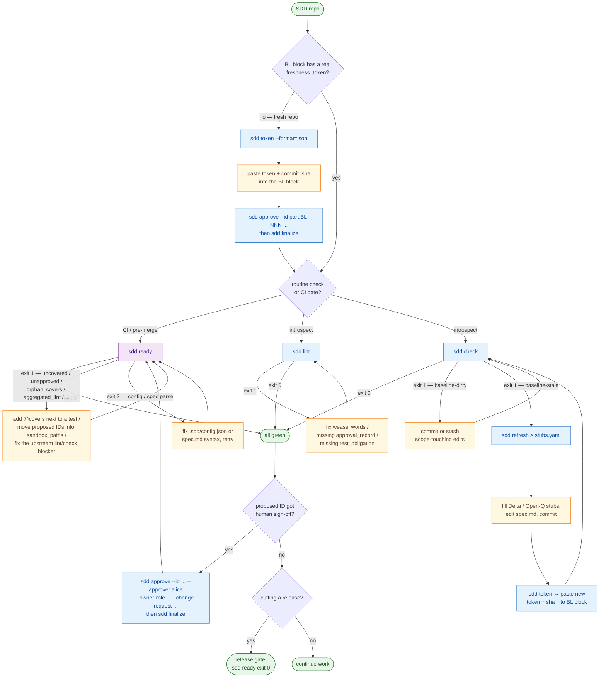

# Spec-Driven Development — the approach and the loop

> English · [Русский](sdd-methodology.ru.md)

This document explains *what* Spec-Driven Development is and *how* `agent-sdd`
turns it into a day-to-day loop. For the raw command reference see
[commands.md](commands.md); for the tool's own normative spec see
[`spec/spec.md`](../spec/spec.md).

---

## 1. The core principle

**The specification is the single source of truth. Any change in system
behaviour appears in the spec first; only then is code generated or written.**

That one rule has a sharp consequence: behaviour that exists in code but is
absent from the spec is never silently legitimised. It is either

- **lifted into a normative record** through the standard process, or
- **explicitly marked `unmodeled`** — acknowledged, never silently deleted,
  renamed, or rewritten.

SDD is designed for **brownfield** work — existing codebases with history — not
just green fields. That is why it leans on a *baseline* (what the code is today)
and *deltas* (how it changes), rather than assuming you write the whole spec up
front.

Why bother? Because AI coding agents are fast and confident, and a fast
confident agent with no fixed contract drifts. SDD gives the agent a contract it
cannot quietly edit: it can *propose* changes, but a human approves them, and a
machine check refuses to merge when code and contract disagree.

---

## 2. The atomic unit: a typed normative ID

Every normative statement is one **ID-element** — atomic, uniquely numbered,
and typed. IDs are semantically neutral and partition-scoped:
`<partition>:<neutral-id>`, e.g. `billing:REQ-017` or `bridge:commands:CON-004`.
Numbers are never reused; a removed element stays in the graph as a `removed`
record.

Each template has its own required, typed fields (a value or an explicit
`not_applicable + reason` — an empty field is invalid). The closed set:

| Template | Use it for |
|----------|------------|
| `Behavior` | A synchronous, observable, single-actor behaviour (`given`/`when`/`then`). |
| `Invariant` | A property that always/never holds; carries `evidence` + `stability`. |
| `Contract` | A boundary contract: HTTP API, DB schema, event, file format, CLI, error code. |
| `Scenario` | A stateful / async / event-driven sequence with ordering + retry semantics. |
| `NFR` | A non-functional requirement with a measurable target and a verification stage. |
| `Constraint` | An externally-imposed technology/implementation constraint + rationale. |
| `Policy` | Authz / tenant isolation / PII / audit / rate-limit. Every boundary must reference one. |
| `Migration` | A change to data at-rest or a switchover procedure (two-axis lifecycle, see §6). |
| `Delta` | A behaviour change relative to the baseline (`kind`, `compatibility_action`, tests). |
| `GeneratedArtifact` | Generated code / client / SDK, pinned to a generator + command. |
| `ExternalDependency` | A third-party provider (Stripe, S3, an identity provider). |
| `LocalizationContract` | i18n where text or message-ids are themselves a contract. |
| `Surface` | An external compatibility unit — the unit of **semver**. |
| `Partition` | A team / domain area of responsibility; gates run per partition. |
| `ImplementationBinding` | A link from normative IDs to internal artefacts (tables, queues, jobs). |
| `Open-Q` | An open question with ≥2 options and a `blocking` flag. |
| `ASSUMPTION` | A default taken on a non-blocking question, with a `review_by` date. |

### What the spec MUST fix vs MUST NOT fix

The spec pins **external, observable** things and leaves everything internal to
the agent:

- **MUST fix:** external behaviour, `Surface`/`Contract` boundaries,
  `Invariant`s, external identifiers (API fields, events, CLI, public DB
  columns, error codes), external dependencies, policies, migrations,
  applicability (feature flag / tenant / locale / env / plan / api-version), and
  the concurrency model on boundaries.
- **MUST NOT fix:** internal file / module / class / function names, library or
  framework choice (unless there's an external `Constraint`), directory layout,
  internal layering, estimates, schedules, owners.

Everything not normatively fixed is the agent's call — and the agent must list
those internal decisions in the PR as candidates for new `Constraint` / `Policy`
/ `ASSUMPTION`.

---

## 3. Lifecycle and approval

Every normative template carries a lifecycle:


- **`draft`** — sandbox only (lives under `sandbox_paths`).
- **`proposed`** — spec-valid, but not mergeable.
- **`approved`** — implementable. Requires an `approval_record`.
- **`deprecated`** — carries `sunset_version` + `replacement_id`.
- **`removed`** — carries a `compatibility_action ∈ {reject, ignore, migrate,
  no_longer_guaranteed}`.

**Self-approval by the code-gen agent is forbidden.** `sdd approve` refuses agent
identities (Claude, Codex, `bot:*`, `sdd-cli` itself). This is the load-bearing
safety property: an AI can author and propose, a human signs off.

Approval is a **two-step** process, and `agent-sdd` mirrors it with two commands:

1. **`sdd approve`** records a *pending attestation* in a plan-namespace artefact
   (`.sdd/plans/<plan_id>.yaml`). No `lifecycle.status` changes yet.
2. **`sdd finalize`** validates the resulting reference graph and *atomically*
   flips `lifecycle.status = approved` and writes the ID-level `approval_record`.

Between the two steps the invariant «`approved` ⇒ graph-consistent» holds by
construction. To approve several IDs that reference each other (a `Surface` and
its member `Contract`s), queue them all into **one** plan and run a single
`finalize` — piecemeal finalize fails with `proposed-references`.

`Surface` is the unit of semver. Bumping a `Policy` or an
`Invariant(stability=contractual)` cascades to every referencing Surface: a
content change ⇒ ≥ minor, a predicate change ⇒ major.

---

## 4. The three gates

Gates run **per partition**, so drift in one area never blocks everyone.

1. **`baseline-valid`** — the partition's *Discovery scope* is covered by
   evidence, and the `freshness_token` matches the current input sources. Each
   `Delta` / `Migration` pins to a `baseline_version`. A stale baseline blocks
   only the *move into* `implementation-valid`, not the authoring of new
   `Delta` / `Open-Q`.
   → enforced by **`sdd token`** + **`sdd check`**.
2. **`spec-valid`** — structure, required fields per template, correct field
   types, no weasel words in normative sections, a two-way `ID ↔ Test
   obligation` link, semver per Surface, an `approval_record` on every
   approved/deprecated/removed ID, no self-approval, no unresolved blocking
   `Open-Q`.
   → enforced by **`sdd lint`**.
3. **`implementation-valid`** — every `Test obligation` is materialised as ≥ 1
   executable test carrying `@covers <partition>:<id>`; all approved IDs are
   green; removed IDs have tests for their `compatibility_action`; the agent's
   internal decisions are listed in the PR. **This gate is a signal, not a
   proof** — for a major-bump Surface, a human must review the test (oracle,
   input classes, negative oracle).
   → enforced by **`sdd ready`** (a strict superset of `lint` + `check`).

---

## 5. The Brownfield baseline and the freshness token

`agent-sdd` reads a single YAML block in your spec whose `id` equals
`config.baseline_id` and whose `type` is `BrownfieldBaseline`. It carries, among
other fields:

```yaml
id: my-partition:BL-001
type: BrownfieldBaseline
freshness_token: <64-char hex>       # sha256 over the Discovery scope
baseline_commit_sha: <40-char hex>   # the commit the token was computed at
mechanism: git_tree_hash_v1
```

The **freshness token** is a deterministic fingerprint of a configured slice of
the repo (`discovery_scope`). With the built-in git adapter it is
`sha256(git ls-tree HEAD -- <scope>)`. Because git's `ls-tree` output is
canonical, the token is stable across invocations and independent of the order
of scope entries.

Its whole point: without a mechanical token, an agent has no way to *detect* that
the source tree drifted from the baseline the spec claims to describe. With it,
`sdd check` can say "the recorded baseline no longer matches reality" and stop
the pipeline until a human reconciles the drift.

The token mechanism is pluggable. The built-in backend is git; any other VCS
ships as an external adapter that declares its own `mechanism`. See
[writing-vcs-adapters.md](writing-vcs-adapters.md).

---

## 6. Brownfield rules in brief

- A `Brownfield baseline` is non-normative until a `REQ`/`Invariant`/`Contract`
  references it as *preserved*.
- Anything outside `Discovery scope` is `unmodeled` — never silently deleted or
  rewritten. Widening scope requires fresh reconnaissance.
- Every behaviour change → a `Delta` (with `kind`, `compatibility_action`,
  `tests_old_behavior`, `tests_new_behavior`, `baseline_version`).
- Data-at-rest changes → a `Migration`, which carries **two orthogonal axes**:
  the spec lifecycle (`draft..removed`, governs lint) and a runtime state
  (`pre_cutover → in_progress → cutover_done → rolled_back`, governs which tests
  apply). `sdd ready` only checks tests applicable to the current runtime state.
- Debt is iterative: each partition tracks an `unmodeled_budget` that shrinks per
  PR. "Bring the whole codebase to target in one PR" is explicitly *not*
  required.

---

## 7. TDD under SDD — where Red comes from

SDD keeps the Red → Green → Refactor cycle, but the **source of the Red test**
and the **definition of done** are anchored to the spec:

1. **Spec** — author / amend the ID(s) and their `Test obligation`s.
2. **Spec-lint** — `sdd lint` exit 0.
3. **Red** — for each open obligation write one failing test carrying
   `@covers <partition>:<id>`. It must fail on the assertion, not on a missing
   import. One Red at a time.
4. **Green** — the minimum code to turn that Red green; only what an approved ID
   authorises.
5. **Refactor** — structure only; observable behaviour on approved IDs unchanged.
6. **`implementation-valid`** — `sdd ready` exit 0. Coverage holes surface here.

If you cannot trace a test to a `Test obligation`, it does not belong: either
raise an `Open-Q` to extend the spec, or drop the test. Renaming a public Surface
field or changing an Invariant predicate is **not** a refactor — it is a `Delta`:
stop, edit the spec, re-lint, re-Red.

---

## 8. Stop conditions — when the agent must halt

An agent following SDD raises an `Open-Q` (and stops) rather than guessing when
it hits any of:

- a term not in the `Glossary`;
- behaviour outside `Discovery scope`;
- a code ↔ spec contradiction without a `Delta`;
- a weasel word in a normative section;
- a removal without a `compatibility_action`;
- a missing `Policy` reference / `applicability` / `concurrency_model` /
  `data_scope` / `baseline_version` on a declared boundary;
- a provider-owned behaviour without an `ExternalDependency`, generated output
  without a `GeneratedArtifact`, or text-as-contract without a
  `LocalizationContract`.

The distinction matters: some of these are *reflexes* on a closed condition
(halt immediately), others are *judgment calls* (classify and record the
rationale in the PR).

---

## The SDD loop

Two views of the same loop: an annotated flowchart for the full lifecycle, and a
"I know my situation, give me the command" table.



Read it in four layers:

1. **Bootstrap** (left branch off `Q1`) — one-time, when the BrownfieldBaseline
   block still has placeholders. Compute the token, paste it in, approve +
   finalize the BL record with a human identity, confirm `sdd check` is green.
2. **CI / pre-merge** (`Q2 → RDY`) — `sdd ready` is the single authoritative
   gate. It re-runs `sdd lint` and `sdd check` under one JSON envelope and adds
   marker-coverage, sandbox-isolation, and `compatibility_action` checks. Put it
   in your protected-branch policy and you do not need to wire `lint` and `check`
   separately.
3. **Introspection** (`Q2 → L` / `Q2 → C`) — when you want a focused answer to
   one question (just spec rules, just scope freshness), the dedicated commands
   narrow the diagnostics.
4. **Drift response** (right branch off `C`) — when `sdd check` reports
   `baseline-stale`, `sdd refresh` emits one stub per drifted path. A human fills
   the stubs, updates the spec, then the token is recomputed and re-recorded.

Approval is human-only by design and never a way to bypass `sdd ready`.

### When to run which command

| Situation | Command(s) |
|-----------|-----------|
| Fresh repo, BrownfieldBaseline still has placeholders | `sdd token` → paste → `sdd approve --id <part>:BL-NNN …` → `sdd finalize` → `sdd check` |
| **Pre-merge / pre-deploy CI gate** | **`sdd ready`** (superset of `lint` + `check`) |
| **Pre-release sanity check** | **`sdd ready`** |
| Introspect: does the spec follow SDD rules? | `sdd lint` |
| Introspect: did anything in scope drift since baseline? | `sdd check` |
| `sdd ready` flags `[uncovered]` | add `// @covers <partition>:<id>` next to a test, or set `Test obligation: not_applicable + reason` in the spec |
| `sdd ready` flags `[unapproved]` | promote via `sdd approve`/`sdd finalize` (human identity), or move the proposed ID's file into `sandbox_paths` |
| `sdd check` reports `baseline-dirty` | commit or stash your scope-touching edits, re-run |
| `sdd check` reports `baseline-stale` | `sdd refresh > stubs.yaml` → fill stubs → commit → `sdd token` → paste fresh token + sha → `sdd check` |
| Reviewer signed off on a `proposed` ID | `sdd approve --id … --approver <human> …` → `sdd finalize` → `sdd ready` |
| Inspect the current scope token without touching the spec | `sdd token` |

---

## Worked workflows

### A — bootstrapping a new SDD baseline

You have a repo with a spec, but no real `freshness_token` yet.

```sh
# 1. add .sdd/config.json + an empty BrownfieldBaseline block in spec.md
#    (leave freshness_token / baseline_commit_sha as placeholders)

# 2. compute the real token at HEAD
sdd token --format=json          # → {"token":"<T>","commit_sha":"<SHA>", ...}

# 3. paste T and SHA into the BL-001 block, commit

# 4. record the human approval, then flip it atomically
sdd approve --id my:BL-001 --approver alice \
  --owner-role tech-lead --change-request https://example.com/pr/1
sdd finalize

# 5. confirm consistency
sdd check                        # exit 0
```

### B — a scope-touching change landed

After committing a code change, `sdd check` reports `baseline-stale`. The spec is
the source of truth, so you cannot just re-record the new token — you must
describe the change first.

```sh
sdd refresh > /tmp/stubs.yaml
```

For every changed path the CLI emits exactly one stub:

- a **`Delta`** stub if the path lives inside an existing `IMP-*` footprint — fill
  in `compatibility_action`, `kind_of_change`, and the test references, then add
  it to your spec's Deltas;
- an **`Open-Q`** stub if the path is in scope but no IMP claims it — decide
  whether to bind it to a normative id or leave it unmodeled.

After the spec edits land, recompute and re-record the token:

```sh
sdd token --format=json | jq -r .token       # → BL-001.freshness_token
sdd token --format=json | jq -r .commit_sha  # → BL-001.baseline_commit_sha
sdd check                                     # green again
```

### C — promoting a `proposed` ID to `approved`

When a human reviewer signs off on an ID (a Behavior, Contract, Invariant,
Surface, …):

```sh
sdd approve \
  --id "my-partition:BEH-014" \
  --approver alice \
  --owner-role tech-lead \
  --change-request "https://example.com/pr/42"
sdd finalize
```

`sdd approve` writes a pending attestation; `sdd finalize` validates the graph
and flips the status, stamping:

```yaml
lifecycle.status: approved
approval_record:
  owner_role: tech-lead
  approver_identity: alice
  timestamp: 2026-04-30T10:15:42.001Z
  change_request: https://example.com/pr/42
  scope: first-time-approval
```

If `--approver` is an agent identity, `sdd approve` exits 1 (`agent-approver`)
and writes nothing. To approve a Surface plus its member Contracts, queue them
all in one plan and run a single `finalize`.

### D — confirming a release

Right before tagging, `sdd ready` should be exit 0. That single signal means:
spec rules pass, the recorded baseline is fresh, every approved ID has a
`@covers` test, no `proposed`/`draft` ID slipped outside `sandbox_paths`, and the
working tree is clean. Releasing without it breaks SDD's invariant that the spec
is the source of truth.

---

## Further reading

- [commands.md](commands.md) — every command, flag, exit code, and JSON shape.
- [installing-rules.md](installing-rules.md) — put this methodology into your AI
  agent's config so the agent follows it automatically.
- [configuration.md](configuration.md) — `.sdd/config.json` and the baseline block.
- [`spec/spec.md`](../spec/spec.md) — the tool's own normative specification.
