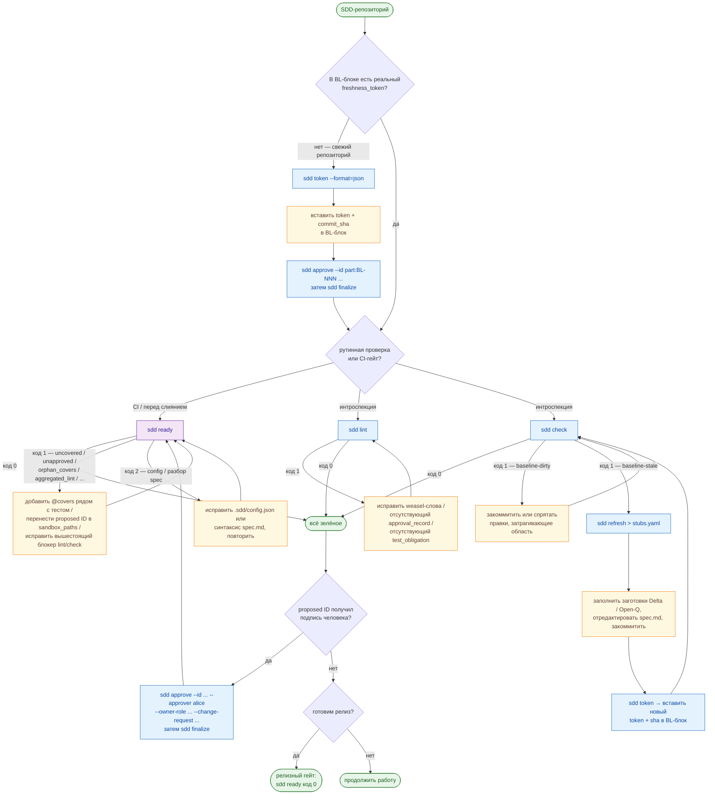

# Spec-Driven Development — подход и цикл

> Русский · [English](sdd-methodology.md)

Этот документ объясняет, *что* такое Spec-Driven Development и *как* `agent-sdd`
превращает его в повседневный цикл. Полный справочник по командам см. в
[commands.ru.md](commands.ru.md); собственную нормативную спецификацию
инструмента — в [`spec/spec.md`](../spec/spec.md).

---

## 1. Базовый принцип

**Спецификация — единственный источник истины. Любое изменение поведения
системы сначала появляется в спецификации; только затем генерируется или пишется
код.**

У этого единственного правила есть жёсткое следствие: поведение, которое
существует в коде, но отсутствует в спецификации, никогда не легитимизируется
молча. Оно либо

- **поднимается в нормативную запись** через стандартный процесс, либо
- **явно помечается как `unmodeled`** — признаётся, но никогда молча не удаляется,
  не переименовывается и не переписывается.

SDD рассчитан на работу с **brownfield** — существующими кодовыми базами с
историей, а не только с «чистым полем». Именно поэтому он опирается на *базовую
линию* (каков код сегодня) и *дельты* (как он меняется), а не предполагает, что
вы пишете всю спецификацию заранее.

Зачем всё это? Потому что ИИ-агенты, пишущие код, быстры и уверены в себе, а
быстрый уверенный агент без фиксированного контракта дрейфует. SDD даёт агенту
контракт, который тот не может тихо отредактировать: он может *предлагать*
изменения, но одобряет их человек, а машинная проверка отказывается сливать
изменения, когда код и контракт расходятся.

---

## 2. Атомарная единица: типизированный нормативный ID

Каждое нормативное утверждение — это один **ID-элемент**: атомарный, уникально
пронумерованный и типизированный. ID семантически нейтральны и привязаны к
партиции: `<partition>:<neutral-id>`, например `billing:REQ-017` или
`bridge:commands:CON-004`. Номера никогда не переиспользуются; удалённый элемент
остаётся в графе как запись `removed`.

У каждого шаблона свои обязательные типизированные поля (значение или явное
`not_applicable + reason` — пустое поле недопустимо). Замкнутый набор:

| Шаблон | Для чего использовать |
|----------|------------|
| `Behavior` | Синхронное, наблюдаемое поведение одного актора (`given`/`when`/`then`). |
| `Invariant` | Свойство, которое всегда/никогда не выполняется; несёт `evidence` + `stability`. |
| `Contract` | Контракт границы: HTTP API, схема БД, событие, формат файла, CLI, код ошибки. |
| `Scenario` | Последовательность с состоянием / асинхронная / событийная, с семантикой упорядочивания и повторов. |
| `NFR` | Нефункциональное требование с измеримой целью и стадией верификации. |
| `Constraint` | Извне навязанное технологическое/реализационное ограничение + обоснование. |
| `Policy` | Авторизация / изоляция тенантов / PII / аудит / rate-limit. Каждая граница должна ссылаться хотя бы на одну. |
| `Migration` | Изменение данных в состоянии покоя или процедура переключения (двухосный жизненный цикл, см. §6). |
| `Delta` | Изменение поведения относительно базовой линии (`kind`, `compatibility_action`, тесты). |
| `GeneratedArtifact` | Сгенерированный код / клиент / SDK, привязанный к генератору + команде. |
| `ExternalDependency` | Сторонний провайдер (Stripe, S3, провайдер идентичности). |
| `LocalizationContract` | i18n, где текст или message-id сами являются контрактом. |
| `Surface` | Единица внешней совместимости — единица **semver**. |
| `Partition` | Командная / доменная зона ответственности; гейты выполняются по партициям. |
| `ImplementationBinding` | Связь нормативных ID с внутренними артефактами (таблицы, очереди, задачи). |
| `Open-Q` | Открытый вопрос с ≥2 вариантами и флагом `blocking`. |
| `ASSUMPTION` | Умолчание, принятое по неблокирующему вопросу, с датой `review_by`. |

### Что спецификация ДОЛЖНА фиксировать, а что НЕ должна

Спецификация закрепляет **внешние, наблюдаемые** вещи и оставляет всё
внутреннее на усмотрение агента:

- **ДОЛЖНА фиксировать:** внешнее поведение, границы `Surface`/`Contract`,
  `Invariant`ы, внешние идентификаторы (поля API, события, CLI, публичные
  колонки БД, коды ошибок), внешние зависимости, политики, миграции,
  применимость (feature flag / тенант / локаль / окружение / план / версия API)
  и модель конкурентности на границах.
- **НЕ должна фиксировать:** внутренние имена файлов / модулей / классов /
  функций, выбор библиотеки или фреймворка (если только нет внешнего
  `Constraint`), раскладку каталогов, внутреннее слоение, оценки, сроки,
  владельцев.

Всё, что не зафиксировано нормативно, — решение агента, и агент обязан
перечислить эти внутренние решения в PR как кандидаты на новые `Constraint` /
`Policy` / `ASSUMPTION`.

---

## 3. Жизненный цикл и одобрение

Каждый нормативный шаблон несёт жизненный цикл:


- **`draft`** — только песочница (живёт под `sandbox_paths`).
- **`proposed`** — валиден по спецификации, но не пригоден к слиянию.
- **`approved`** — реализуемый. Требует `approval_record`.
- **`deprecated`** — несёт `sunset_version` + `replacement_id`.
- **`removed`** — несёт `compatibility_action ∈ {reject, ignore, migrate,
  no_longer_guaranteed}`.

**Самоутверждение агентом, генерирующим код, запрещено.** `sdd approve`
отклоняет агентские идентичности (Claude, Codex, `bot:*`, сам `sdd-cli`). Это
несущее свойство безопасности: ИИ может авторствовать и предлагать, подписывает
человек.

Одобрение — **двухшаговый** процесс, и `agent-sdd` отражает его двумя командами:

1. **`sdd approve`** записывает *ожидающую аттестацию* в артефакт пространства
   имён плана (`.sdd/plans/<plan_id>.yaml`). `lifecycle.status` пока не меняется.
2. **`sdd finalize`** валидирует полученный граф ссылок и *атомарно*
   переключает `lifecycle.status = approved` и записывает `approval_record` на
   уровне ID.

Между двумя шагами инвариант «`approved` ⇒ граф консистентен» удерживается по
построению. Чтобы одобрить несколько ID, ссылающихся друг на друга (`Surface` и
его `Contract`-члены), поставьте их все в **один** план и запустите один
`finalize` — пофрагментный finalize падает с `proposed-references`.

`Surface` — единица semver. Изменение `Policy` или
`Invariant(stability=contractual)` каскадно распространяется на каждый ссылающийся
Surface: изменение содержимого ⇒ ≥ minor, изменение предиката ⇒ major.

---

## 4. Три гейта

Гейты выполняются **по партициям**, поэтому дрейф в одной зоне никогда не
блокирует всех.

1. **`baseline-valid`** — *область обнаружения* (Discovery scope) партиции
   покрыта свидетельствами, а `freshness_token` соответствует текущим входным
   источникам. Каждая `Delta` / `Migration` привязана к `baseline_version`.
   Устаревший базлайн блокирует только *переход в* `implementation-valid`, а не
   авторинг новых `Delta` / `Open-Q`.
   → обеспечивается **`sdd token`** + **`sdd check`**.
2. **`spec-valid`** — структура, обязательные поля по шаблону, корректные типы
   полей, отсутствие weasel-слов в нормативных секциях, двусторонняя связь
   `ID ↔ Test obligation`, semver по Surface, `approval_record` на каждом
   approved/deprecated/removed ID, отсутствие самоутверждения, отсутствие
   неразрешённых блокирующих `Open-Q`.
   → обеспечивается **`sdd lint`**.
3. **`implementation-valid`** — каждое `Test obligation` материализовано как ≥ 1
   исполняемый тест с маркером `@covers <partition>:<id>`; все approved ID
   зелёные; у removed ID есть тесты на их `compatibility_action`; внутренние
   решения агента перечислены в PR. **Этот гейт — сигнал, а не
   доказательство** — для Surface с major-бампом человек должен просмотреть тест
   (оракул, классы входов, негативный оракул).
   → обеспечивается **`sdd ready`** (строгое надмножество `lint` + `check`).

---

## 5. Brownfield-базлайн и токен свежести

`agent-sdd` читает единственный YAML-блок в вашей спецификации, чей `id` равен
`config.baseline_id`, а `type` — `BrownfieldBaseline`. Среди прочих полей он
несёт:

```yaml
id: my-partition:BL-001
type: BrownfieldBaseline
freshness_token: <64-char hex>       # sha256 по области обнаружения (Discovery scope)
baseline_commit_sha: <40-char hex>   # коммит, на котором вычислен токен
mechanism: git_tree_hash_v1
```

**Токен свежести** — детерминированный отпечаток сконфигурированного среза
репозитория (`discovery_scope`). Со встроенным git-адаптером это
`sha256(git ls-tree HEAD -- <scope>)`. Поскольку вывод `ls-tree` в git
каноничен, токен стабилен между вызовами и не зависит от порядка элементов
области.

Весь его смысл: без машинного токена у агента нет способа *обнаружить*, что
дерево исходников дрейфануло от базовой линии, которую спецификация якобы
описывает. С ним `sdd check` может сказать «записанный базлайн больше не
соответствует реальности» и остановить пайплайн, пока человек не согласует
дрейф.

Механизм токена подключаемый. Встроенный бэкенд — git; любая другая VCS
поставляется как внешний адаптер, объявляющий собственный `mechanism`. См.
[writing-vcs-adapters.ru.md](writing-vcs-adapters.ru.md).

---

## 6. Brownfield-правила вкратце

- `Brownfield baseline` ненормативен, пока `REQ`/`Invariant`/`Contract` не
  сошлётся на него как на *сохраняемый*.
- Всё, что вне `Discovery scope`, — `unmodeled`; никогда не удаляется и не
  переписывается молча. Расширение области требует свежей рекогносцировки.
- Каждое изменение поведения → `Delta` (с `kind`, `compatibility_action`,
  `tests_old_behavior`, `tests_new_behavior`, `baseline_version`).
- Изменения данных в состоянии покоя → `Migration`, которая несёт **две
  ортогональные оси**: жизненный цикл спецификации (`draft..removed`, управляет
  lint) и runtime-состояние (`pre_cutover → in_progress → cutover_done →
  rolled_back`, управляет тем, какие тесты применимы). `sdd ready` проверяет
  только тесты, применимые к текущему runtime-состоянию.
- Долг итеративен: каждая партиция отслеживает `unmodeled_budget`, который
  сокращается с каждым PR. «Привести всю кодовую базу к цели за один PR» явно
  *не* требуется.

---

## 7. TDD в рамках SDD — откуда берётся Red

SDD сохраняет цикл Red → Green → Refactor, но **источник Red-теста** и
**определение готовности** заякорены на спецификацию:

1. **Spec** — авторство / правка ID и их `Test obligation`.
2. **Spec-lint** — `sdd lint` завершается с кодом 0.
3. **Red** — для каждого открытого обязательства пишется один падающий тест с
   маркером `@covers <partition>:<id>`. Он должен падать на ассерте, а не на
   отсутствующем импорте. По одному Red за раз.
4. **Green** — минимум кода, чтобы этот Red стал зелёным; только то, что
   санкционирует approved ID.
5. **Refactor** — только структура; наблюдаемое поведение на approved ID
   неизменно.
6. **`implementation-valid`** — `sdd ready` завершается с кодом 0. Дыры в
   покрытии всплывают здесь.

Если тест нельзя проследить до `Test obligation`, ему здесь не место: либо
поднимите `Open-Q`, чтобы расширить спецификацию, либо уберите тест.
Переименование поля публичного Surface или изменение предиката Invariant — **не**
рефакторинг, это `Delta`: остановитесь, правьте спецификацию, перезапустите
lint, перезапустите Red.

---

## 8. Стоп-условия — когда агент обязан остановиться

Агент, следующий SDD, поднимает `Open-Q` (и останавливается), а не гадает, когда
натыкается на любое из:

- термин, отсутствующий в `Glossary`;
- поведение вне `Discovery scope`;
- противоречие код ↔ спецификация без `Delta`;
- weasel-слово в нормативной секции;
- удаление без `compatibility_action`;
- отсутствующая ссылка на `Policy` / `applicability` / `concurrency_model` /
  `data_scope` / `baseline_version` на объявленной границе;
- поведение, принадлежащее провайдеру, без `ExternalDependency`,
  сгенерированный вывод без `GeneratedArtifact` или текст-как-контракт без
  `LocalizationContract`.

Различие важно: одни из них — *рефлексы* на замкнутое условие (остановиться
немедленно), другие — *суждения* (классифицировать и записать обоснование в PR).

---

## Цикл SDD

Два вида одного цикла: аннотированная блок-схема полного жизненного цикла и
таблица «я знаю свою ситуацию, дай команду».



Читайте её в четыре слоя:

1. **Bootstrap** (левая ветвь от `Q1`) — разовый, когда блок BrownfieldBaseline
   ещё содержит заглушки. Вычислите токен, вставьте его, approve + finalize
   BL-записи с идентичностью человека, подтвердите, что `sdd check` зелёный.
2. **CI / перед слиянием** (`Q2 → RDY`) — `sdd ready` — единственный
   авторитетный гейт. Он перезапускает `sdd lint` и `sdd check` в одном
   JSON-конверте и добавляет проверки покрытия маркерами, изоляции песочницы и
   `compatibility_action`. Пропишите его в политику защищённой ветки, и вам не
   нужно подключать `lint` и `check` отдельно.
3. **Интроспекция** (`Q2 → L` / `Q2 → C`) — когда нужен сфокусированный ответ на
   один вопрос (только правила спецификации, только свежесть области),
   специализированные команды сужают диагностику.
4. **Реакция на дрейф** (правая ветвь от `C`) — когда `sdd check` сообщает
   `baseline-stale`, `sdd refresh` выдаёт по одной заготовке на каждый
   дрейфанувший путь. Человек заполняет заготовки, обновляет спецификацию, затем
   токен пересчитывается и перезаписывается.

Одобрение по замыслу доступно только человеку и никогда не является способом
обойти `sdd ready`.

### Когда какую команду запускать

| Ситуация | Команда(-ы) |
|-----------|-----------|
| Свежий репозиторий, в BrownfieldBaseline ещё заглушки | `sdd token` → вставить → `sdd approve --id <part>:BL-NNN …` → `sdd finalize` → `sdd check` |
| **CI-гейт перед слиянием / деплоем** | **`sdd ready`** (надмножество `lint` + `check`) |
| **Проверка здоровья перед релизом** | **`sdd ready`** |
| Интроспекция: следует ли спецификация правилам SDD? | `sdd lint` |
| Интроспекция: дрейфануло ли что-то в области с момента базлайна? | `sdd check` |
| `sdd ready` сигналит `[uncovered]` | добавить `// @covers <partition>:<id>` рядом с тестом или указать `Test obligation: not_applicable + reason` в спецификации |
| `sdd ready` сигналит `[unapproved]` | продвинуть через `sdd approve`/`sdd finalize` (идентичность человека) или перенести файл proposed ID в `sandbox_paths` |
| `sdd check` сообщает `baseline-dirty` | закоммитить или спрятать правки, затрагивающие область, повторить |
| `sdd check` сообщает `baseline-stale` | `sdd refresh > stubs.yaml` → заполнить заготовки → закоммитить → `sdd token` → вставить свежий token + sha → `sdd check` |
| Ревьюер подписал `proposed` ID | `sdd approve --id … --approver <human> …` → `sdd finalize` → `sdd ready` |
| Посмотреть текущий токен области, не трогая спецификацию | `sdd token` |

---

## Разобранные сценарии

### A — начальная настройка нового SDD-базлайна

У вас есть репозиторий со спецификацией, но пока без реального `freshness_token`.

```sh
# 1. добавить .sdd/config.json + пустой блок BrownfieldBaseline в spec.md
#    (оставить freshness_token / baseline_commit_sha как плейсхолдеры)

# 2. вычислить реальный токен на HEAD
sdd token --format=json          # → {"token":"<T>","commit_sha":"<SHA>", ...}

# 3. вставить T и SHA в блок BL-001, закоммитить

# 4. записать человеческое утверждение, затем атомарно переключить
sdd approve --id my:BL-001 --approver alice \
  --owner-role tech-lead --change-request https://example.com/pr/1
sdd finalize

# 5. подтвердить согласованность
sdd check                        # код 0
```

### B — приземлилось изменение, затрагивающее область

После коммита изменения кода `sdd check` сообщает `baseline-stale`.
Спецификация — источник истины, поэтому нельзя просто перезаписать новый токен —
сначала нужно описать изменение.

```sh
sdd refresh > /tmp/stubs.yaml
```

Для каждого изменённого пути CLI выдаёт ровно одну заготовку:

- заготовку **`Delta`**, если путь лежит внутри существующего следа `IMP-*` —
  заполните `compatibility_action`, `kind_of_change` и ссылки на тесты, затем
  добавьте её в Delta-раздел спецификации;
- заготовку **`Open-Q`**, если путь в области, но ни один IMP его не заявляет —
  решите, привязать ли его к нормативному id или оставить unmodeled.

После того как правки спецификации приземлились, пересчитайте и перезапишите
токен:

```sh
sdd token --format=json | jq -r .token       # → BL-001.freshness_token
sdd token --format=json | jq -r .commit_sha  # → BL-001.baseline_commit_sha
sdd check                                     # снова зелёный
```

### C — продвижение `proposed` ID в `approved`

Когда ревьюер-человек подписывает ID (`Behavior`, `Contract`, `Invariant`,
`Surface`, …):

```sh
sdd approve \
  --id "my-partition:BEH-014" \
  --approver alice \
  --owner-role tech-lead \
  --change-request "https://example.com/pr/42"
sdd finalize
```

`sdd approve` записывает ожидающую аттестацию; `sdd finalize` валидирует граф и
переключает статус, проставляя:

```yaml
lifecycle.status: approved
approval_record:
  owner_role: tech-lead
  approver_identity: alice
  timestamp: 2026-04-30T10:15:42.001Z
  change_request: https://example.com/pr/42
  scope: first-time-approval
```

Если `--approver` — агентская идентичность, `sdd approve` завершается с кодом 1
(`agent-approver`) и ничего не пишет. Чтобы одобрить Surface вместе с его
Contract-членами, поставьте их все в один план и запустите один `finalize`.

### D — подтверждение релиза

Прямо перед проставлением тега `sdd ready` должен завершаться с кодом 0. Этот
единственный сигнал означает: правила спецификации проходят, записанный базлайн
свежий, у каждого approved ID есть `@covers`-тест, ни один `proposed`/`draft` ID
не выскользнул за пределы `sandbox_paths`, а рабочее дерево чистое. Релиз без
этого нарушает инвариант SDD о том, что спецификация — источник истины.

---

## Дополнительное чтение

- [commands.ru.md](commands.ru.md) — каждая команда, флаг, код возврата и форма JSON.
- [installing-rules.ru.md](installing-rules.ru.md) — как встроить эту методологию
  в конфиг вашего ИИ-агента, чтобы агент следовал ей автоматически.
- [configuration.ru.md](configuration.ru.md) — `.sdd/config.json` и блок базовой линии.
- [`spec/spec.md`](../spec/spec.md) — собственная нормативная спецификация инструмента.
